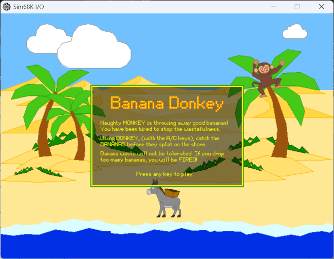
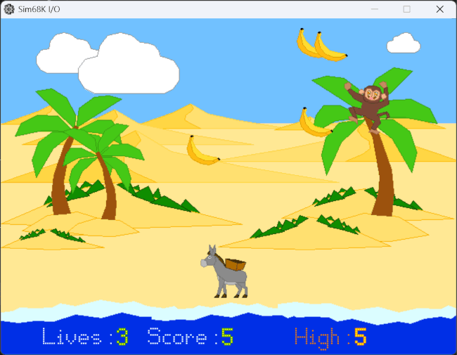
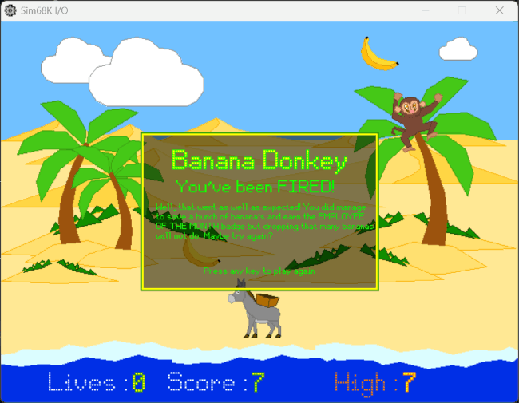

```text
            ░░     ____
    ▒     ▒▒░     |  _ \                                    ▒░░
   ▒ ▒░░   ▒▒▒▒░░ | |_) | __ _ _ __   __ _ _ __   __ _   ▒▒░░    ▒▒▒ ░
  ▒░░     ▒▒▒▒▒░░ |  _ < / _` | '_ \ / _` | '_ \ / _` | ▒▒▒░░ ▒     ▒░░
▒▒▒░░█    █ ▒▒░░  | |_) | (_| | | | | (_| | | | | (_| |  ▒░░ ▒█    █▒▒░░
 ▒▒▒░░███  █   ░  |____/ \__,_|_| |_|\__,_|_| |_|\__,_|   ░  ██  ███▒▒░░
  ▒▒░░  ██ █        _____              _                     ██ █  ▒▒░░
  ▒▒  ░  ████      |  __ \            | |                   ████  ▒  ░░
          ███      | |  | | ___  _ __ | | _____ _   _       ███
           ██      | |  | |/ _ \| '_ \| |/ / _ \ | | |      ██
           ██      | |__| | (_) | | | |   <  __/ |_| |      ██
            ██     |_____/ \___/|_| |_|_|\_\___|\__, |     ██
    ▒▒      ██   ░                               __/ | ▒   ██      ░░
      ▒▒▒▒▒▒▒▒▒░░                               |___/   ▒▒▒▒▒▒▒▒▒░░
```

# Banana Donkey

A simple video game written in 68000 Assembly Code, designed to be run on the EASy68K M68K emulator.

## About

I wrote my first computer program in QL Super Basic in 1985 and completely skipped learning Assembly code. So 40 years later, it felt like the right time to learn :-D Rather than X86 I chose to learn 68000 Assembly because that is what I would have used had I learned it on my QL. My intention was to learn enough assembly code to get a feel for what it was like to work with assembly code and I think I have achieved that with this game.

## The Game

This game is a fairly obvious clone of Nintendo's AMAZING Parachute on the Game & Watch. But rather than a helicopter deploying parachutists over an ocean to be caught by a boat, it's a monkey throwing bananas to be caught by a donkey.

The bananas come down one of three lanes that arc from the top of a palm tree down the shore where you manoeuvre your donkey to collect them because they land in the sea. It includes sound produced by my son who does excellent monkey noises. You have 3 lives and a high score to chase.

## Screenshots


_Welcome Screen : the premiss and rules of the game_


_Gameplay : lose a life when you drop a banana. Gain score for catching a banana. High score is remembered across retries._


_Death : drop too many bananas and you get fired._

## Controls

I considered cursor keys but settled on WASD or specifically AD. A=left D=right.

## Requirements

EASy68K emulator

Trap #15 is used to handle graphics and sound but the task codes are specific to the EASy68K emulator so this code probably won't work if you just compile it with 68k assembler.

## Running the Game

Assembly of the program is done entirely with EASy68K, just do the following:

1. Launch EASy68K
2. Open the main file called banana-donkey.X68
3. Hit F9 to assemble the code, click 'Execute' then if it launches into the debugger, hit F9

## Project Structure

As this program is about 4500 lines long it would have been unmanageable in a single file so it's split into domain-specific files:

| Folders                     | Description                                                             |
| --------------------------- | ----------------------------------------------------------------------- |
| sounds                      | WAV files used by the game                                              |
| └─m4a                       | The original m4a files recorded on my phone                             |
| sprites                     | Gimp 3.2 files used to design the game sprites                          |
| tools                       | Some support code I used to create the curved paths the bananas follow  |
| utilities                   | A couple of AutoHotkey scripts I used to help with launch the assembler |
| └─easy68k-outline-extension | A VSCode extension to make the Outline pane recognise assembly labels   |

| Files                    | Description                                               |
| ------------------------ | --------------------------------------------------------- |
| banana-donkey.X68        | Main file with includes                                   |
| bresenham-line.X68       | Plot the points on a line from A to B with integer maths  |
| buffers.X68              | Reserved memory space included at the end for EVENness    |
| constants.X68            | Reused constants like colours and coordinates             |
| core.X68                 | Non domain-specific routines like PRNG generator          |
| fonts.x68                | Bitmask font definitions                                  |
| game.X68                 | Main game loop                                            |
| graphics.X68             | Routines used by the graphics engine                      |
| macros.X68               | Useful macros like cache/restore registers                |
| polygons.X68             | Routines for plotting polygons                            |
| sounds.X68               | Routines for playing game sounds                          |
| sprite-data.X68          | The sprite definitions as collections of polygon vertices |
| sprites.X68              | Routines for rendering sprites to the screen              |
| tool-position-sprite.X68 | Helper to position a sprite with cursor keys              |
| trap-fifteen.X68         | All the TRAP #15 calls as subroutines                     |
| variables.X68            | All the variables used by the entire program              |

Included in the utilities\easy68k-outline-extension is a VSCode extension written by GitHub Copilot AI that makes the Outline panel recognise assembly `Labels:` and `.localLabels:`

## Technical Details

### Screen Resolution

EASy68K has a set of standard screen resolutions but you can choose any resolution you like so long as it's no smaller than the minimum of 640x480. I ended up going with 650x480 which was probably unnecessary as it's only 10 pixels more than the minimum default standard VGA resolution.

### Sprites

EASy68K Trap #15 has a limited set of graphics drawing functions; plot a point, draw a line, draw a filled and unfilled rectangle and ellipse. I needed to be able to draw filled polygons so that just left `plot a point` and `draw a line`. So the process for displaying a banana on screen is as follows;

**Define the banana sprite as a series of polygon vertices**

```text
banana:
    dc.b    5
    dc.b    12, 36,11,   48,10,   42,47,   67,92,   113,137, 174,153
    dc.b        229,163, 185,181, 136,181, 81,160,  41,117,  29,47,         $ff,$dd,$31, $ed,$c6,$00    ; banana 1
    dc.b    14, 25,7,    35,10,   29,45,   42,118,  81,160,  137,181
    dc.b        184,182, 203,196, 156,210, 101,202, 44,174,  12,136
    dc.b        0,94,    18,46,                                             $fe,$bc,$13, $d9,$9c,$00    ; banana 2
    dc.b    4,  223,165, 233,175, 203,195, 183,181,                         $fe,$bc,$13, $d9,$9c,$00    ; banana 3
    dc.b    4,  229,163, 236,170, 233,175, 223,167,                         $00,$00,$00, $00,$00,$00    ; bottom end
    dc.b    5,  30,0,    42,1,    49,9,    38,10,   25,6,                   $00,$00,$00, $00,$00,$00    ; top end
bananaSpriteSize dc.w $0000    ; $wwhh
```

The first byte is the number of polygons in the sprite. Then each polygon is defined with the first byte being the number of vertices in the polygon followed by pairs of bytes for each vertex and finally, the fill and outline colours as separate bytes for R,G and B. Each sprite has a separate word variable to hold the sprite's width and height. This could have been hard coded but I chose to figure it out for each sprite when you launch the program to make editing the sprites easier.

**Save the dirty rectangle**

To move the banana once it's been displayed you have to replace what was there to remove it from the screen and then move the banana and re-render it. To do this, before the banana is first drawn on the screen, I have to collect the pixel colour values for every pixel behind the banana and store them in memory. Then when the banana needs to move, I can replace the 'background' and the banana is gone. This only works if the dirty rectangle is only saved when there is nothing that can move within it so before a banana moves, ALL visible bananas are removed from the screen first. This works fine as all the bananas move at the same time anyway so no processing is wasted. Once the screen is clear of bananas, move all the bananas along their paths and redraw each one using the sprite definition above to draw filled polygons.

**Draw the banana**

Drawing the banana requires a number of filled polygons. The way to draw a filled polygon is to collect all the points that make its outline then going from top to bottom, draw a line between the left and right points. This only works for convex polygons but that's a sprite design issue. Take this triangle

```text
        A

          B
  C
```

Using the Bresenham algorithm, find all the points between AB, BC and CA

```text
        A
      CC A
    CC BBBB
  CCBBB
```

While doing this, make sure you only record the leftmost and rightmost point on each line

```text
        A
      C  A
    C     B
  C   B
```

Then you just draw horizontal lines between the pairs of vertices

```text
        X
      XXXX
    XXXXXXX
  XXXXX
```

And there you have it, a filled polygon. If you want the outline to have a different colour that's just a simple case of drawing three lines using the trap 15 line function.

### Fonts

There is a little welcome text required and again, EASy68K text support is very basic; you can print text to the screen in the terminal font, with a filled background and that's it. I wanted a variable size font that can be written over the top of something without destroying the background. So I ended up having to define a bitmask font that I could plot, pixel by pixel on the screen. I can then scale it by increasing the space between the pixels and making each pixel bigger by switching to rectangles instead of pixels. The font is simply an 8x11 grid of bits where a 1 means plot a pixel here. I didn't want the font monospace so the first byte of each character is how wide that character is so an `X` can be 8 pixels wide and an `!` can be 1. Below is the definition of the letter 'f'. If space was an issue it would have been better to store these characters as a series of hex values for each byte, `dc.b 4,$30,$40,$40,$40,$F0,$40,$40,$40,$0,$0,$0`, but for readability and editing I chose binary.

```text
    ; f
    dc.b 4
    dc.b %00110000
    dc.b %01000000
    dc.b %01000000
    dc.b %01000000
    dc.b %11110000
    dc.b %01000000
    dc.b %01000000
    dc.b %01000000
    dc.b %00000000
    dc.b %00000000
    dc.b %00000000
```

### Overlay

I also wanted to display the welcome and death message on an overlay which was a relatively simple process of getting the pixel colour of every pixel in the overlay and reducing its brightness before replotting the pixel. It turns out that you can reduce the brightness of a colour by 50% really cheaply by simply dividing each colour by 2 which can be done by clearing the least significant bit of each colour and then right shifting it one, reducing it by a factor of 2 or in this case, dividing by 2.

```asm
    and.l #$00FEFEFE,d0
    lsr.l #1,d0
```

Given that I already have a mechanism for storing the dirty rectangle of a sprite, I use this to save the pixel data of a 3x2 grid of 100x100 pixel areas, then I darken every pixel by 50% and now I can write text over the top of it and it's readable without destroying the background. To remove the overlay, just replace the dirty rectangle data I saved earlier.

### Sound

EASy68K has some simple trap 15 tasks that let you load a WAV file into memory then play it back with a single trap #15 call. So that made sound really simple.

### Random Numbers

This is simple enough, there is an algorithm called Marsaglia's Xorshift which takes a seed and then XOR shifts it left, right and left by slightly different amounts to produce a statistically random number. It's a fixed number sequence but if you vary the seed by using the system time, you start at a different place in the sequence and thus get a different set of pseudo random numbers.

### Timing

This is handled in the main game loop with a simple check against a variable containing the last time something was done. The bananas are at 100-millisecond intervals so every cycle I check to see if it's been more than 100 milliseconds since the last time the bananas moved and if it has, off we go. Same for the monkey throwing the bananas. The keyboard is polled every cycle to ensure you can move as often as possible but because the graphics routines are quite expensive, once more than about 4 bananas are on screen, the frame rate drops to a point where tapping a key no longer works and you have to give it more of a press to move the donkey.

### Memory Management

Throughout the entire project, making sure that word reads occur on an even address was a real issue. If a memory buffer ends up on an odd address, doing a word or long read will crash the application and it's often not obvious why it crashed. EASy68K doesn't support the EVEN operator so whenever a byte variable is defined I had to make sure its byte length is even and if not, pad it or create another dummy byte variable to keep things even. That's why you see code like `firedText dc.b 'You''ve been FIRED! ',0` with an extra space at the end or `dummyText dc.b 0` variable defined at the end of a list of byte variables that are odd in number.

### Coding Conventions

I chose to stick to lower case for the operations because it's easier on the eye and all labels are followed by a colon. Local labels start with a period and are in `.lowerCamelCase:` while main sub-routine labels are in `UpperCamelCase:` As 68k assembly only has 8 data registers and 8 address registers, it often became too complicated to use just registers so often a variable is employed. I'm sure it would be quicker to only use registers but it becomes increasingly difficult to figure out what value is in a register at a particular moment in time. In assembly code there is a convention of having d0-d3 as volatile and d4-d7 as safe so when you're in a routine you know you can use d0-d3 because the calling routine cached their values on the stack and if you need to use d4-d7 in a routine, simply cache them on the stack and you're good. So before you call out to a sub-routine you push d0-d3/a0-a3 on the stack, then when you get back pop them off and you're good. While you're in a sub-routine, if you need the safe registers, push them to the stack at the start of the routine and pop them off before you rts. In the end, even this required too much discipline so I ended up creating a pair of macros that cache and restore all the registers and just use that at the start of major subroutines.

## Development

My project was to 'Learn 68000 assembly code' and to do that I chose a simple game as the vehicle for that learning. Before I even started with the game, I made a mental list of things I would need to know how to do first and wrote assembly code programs to do those. This was a particularly satisfying and powerful way to learn the fundamentals. These are the smaller projects I did first before starting on the game:

1. Hello World - Bounces the phrase Hello World around the screen to help understand how text is displayed on screen. Didn't end up using any text in final game but did use it to display game state for debugging so still a good thing to know.
2. Jump Table - Cycle through the colours of RGB space using a jump table of labels to decide which bit of code to execute next to cycle the different colours. This taught me about memory addresses and how to read them when loaded into an address register.
3. State Table - A better solution for cycling through the colours where the conditions under which the colour cycle state changes is held in a memory table and the process of cycling is simply taking the current state and seeing if the change conditions have arrived at which point move on to the next state as defined in the table. Further learning about ways to use memory storage for program flow.
4. Keyboard Input - Capture and display variable keyboard combinations to properly understand how the trap 15 call works.
5. A Bubble Sort - Nothing to do with the game but a useful exercise in understanding program flow and looping.
6. Moire Lines - Fill the screen with diagonal lines starting with 0,0 to 500x500 then on to 1,0 to 499,500. So drawing diagonal lines from the top of the screen to the bottom moving from left to right at the top and right to left at the bottom. Then repeat the process for the sides. The result is a Moire pattern where the gaps in the line created by the line drawing algorithm create a pattern. I also included the colour cycling code from step 3 and had it repeat endlessly for a very pleasant visual effect!
7. Drawing triangles with the Bresenham algorithm. This was an essential requirement of the game to be able to create filled polygons as the first process is to draw the outline of the polygon with lines created with the Bresenham algorithm.

## Limitations

- It's slow because the trap #15 calls are super expensive. I did consider doing the project in an Amiga emulator so I could take advantage of the Blitter for much faster graphics operations but this project came directly off the back of a similar nostalgia driven QL Emulator project so I was sticking to as close to QL assembly as I could.
- The graphics are limited to a low poly count because, yup, trap #15 calls are slow.
- Because the framerate is so low, keypresses often get missed and because the framerate fluctuates so much, keypresses become wildly hit and miss.
- It has to run inside the EASy68K emulator.
- Screen res is 650x480 which makes it very small on a 4k display! I originally wanted to do it at the Sinclair QLs native resolution of 256×256 but that was just too small.

## Coding Environment

I started using the editor in EASy68K but eventually switched to VSCode because it's 1000% better in every way!

## AI

I used ChatGPT 4o as a pair programming buddy. It's not awesome and makes a lot of mistakes but it's pretty handy when you've forgotten how to read a byte from an address register and have it advance one byte, or want to know which part of a long word will get affected when you `mulu.b`! I also trialled GitHub Copilot AI on VSCode. VSCode comes with Copilot built-in now and with the flick of a switch, you get a chat panel at the side that has access to your project so you can ask it questions without having to give it a load of context first. It also has an inline suggestion feature that gives you autocomplete suggestions as you're typing. The suggestions are surprisingly accurate, to the point where I type something and hit return and the next suggestion is a chunk of about 5 lines of code that does exactly what I was gonna type! I turned that off fairly quickly because I'm here for the love of programming not the love of getting it done. Also, it is quite difficult to type what you want to type when it's constantly suggesting something, often what you're actually typing. I also didn't use Copilot to write any of my code because...same reason. I could ask Copilot to write code for me and it would insert it correctly into the project, which is amazing, but that wasn't the point of this exercise, so I stuck to nursing GPT through its hallucinations.

I did use ChatGPT to help me set up and code an extension to properly support the Outline feature for a .X68 file. That would have taken a while to get to grips with and GPT just nailed it first time.

## Repository Status

This project is considered complete. I don't expect to be making any further commits.

## Credits

Windows 11 v10.0.26200 Build 26200
EASy68K v5.16.01
Gimp v3.2
Visual Studio Code v1.131.1
GitHub Copilot AI
ChatGPT 4o
All sounds produced by my son's voice
All graphics drawn by me in Gimp with clip art from Google as reference

## License

Banana Donkey is licensed under the [MIT License](LICENSE).
